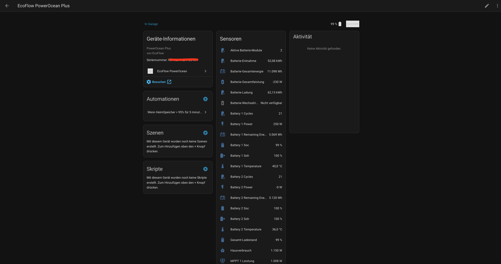
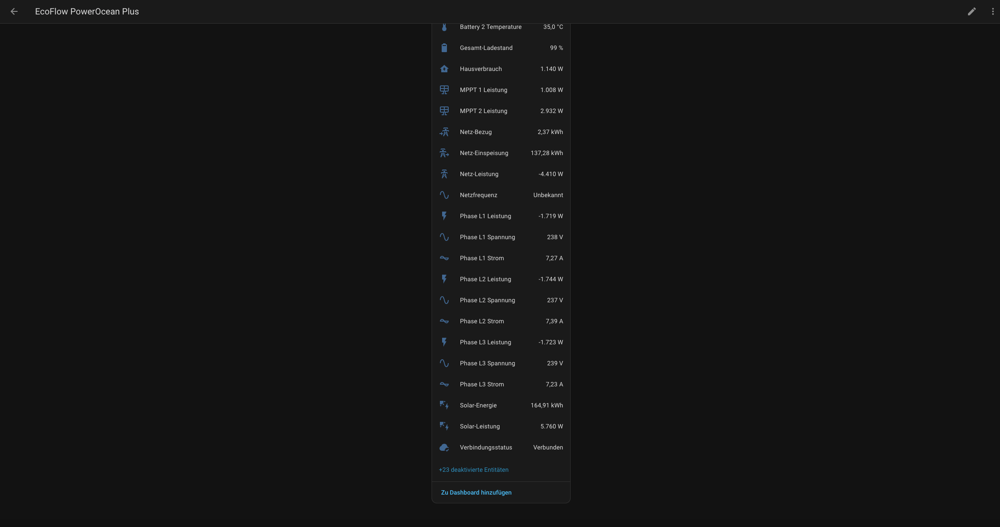
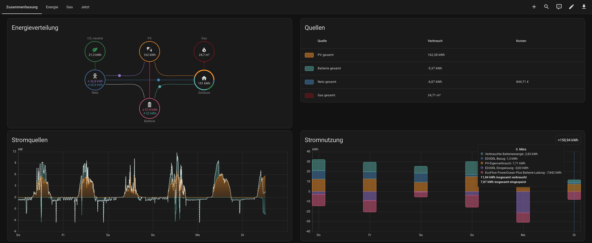
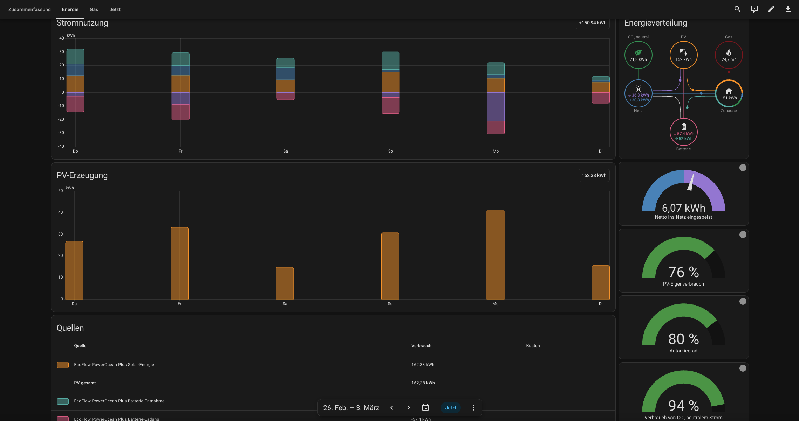
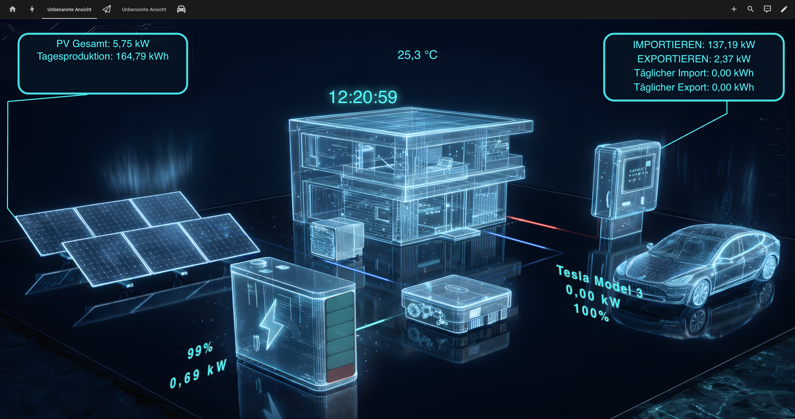

# EcoFlow PowerOcean Plus — Home Assistant Integration

[](https://github.com/Feberdin/ecoflow-powerocean-ha/releases/latest)
[](https://hacs.xyz)
[](https://www.home-assistant.io)
[](LICENSE)

Inoffizielle Home Assistant Integration für die **EcoFlow PowerOcean Plus** Photovoltaik-Heimspeicheranlage. Echtzeit-Monitoring via MQTT — Batterie, Solar, Netz, 3-Phasen und Energie-Dashboard direkt out of the box.

---

## Highlights

- **Batterie-Monitoring** — SOC, SOH, Temperatur, Zyklen, Leistung für bis zu 9 Packs
- **Energiefluss** — Solar, Netz, Hausverbrauch, Batterie-Gesamtleistung
- **3-Phasen Wechselrichter** — Spannung, Strom, Wirk-/Blind-/Scheinleistung je Phase
- **MPPT-Strings** — Leistung, Spannung, Strom für bis zu 4 Strings
- **Energie-Dashboard** — kWh-Zähler direkt integriert, kein YAML nötig
- **Verbindungsstatus** — MQTT-Verbindung als Sensor für Automationen
- **Options Flow** — Anzahl Batterie-Packs jederzeit änderbar ohne Neueinrichtung
- **Gap-Reconciliation** — bei kurzer Internet-Unterbrechung wird die Energielücke beim Reconnect transparent geschätzt

---

## Feature-Wünsche & Feedback

Wenn du neue Funktionen vorschlagen möchtest, nutze bitte das Feature-Template:

- [Feature-Wunsch erstellen](https://github.com/Feberdin/ecoflow-powerocean-ha/issues/new?template=feature_request.md&title=%5BFEATURE%5D%20)

Für Fehler bitte das Bug-Template verwenden:

- [Bug melden](https://github.com/Feberdin/ecoflow-powerocean-ha/issues/new?template=bug_report.md&title=%5BBUG%5D%20)

So bleiben Anforderungen und Prioritäten transparent, und wir können Änderungen besser planen.

---

## Screenshots

### Geräte- und Sensorübersicht in Home Assistant





### Energie-Dashboard (Werte aus dieser Integration)





### Beispielvisualisierung mit Lumina Energy Card



> Hinweis: Die **Lumina Energy Card** ist eine separate Dashboard-Karte.  
> Diese Integration liefert die Sensorwerte, die Visualisierung selbst stammt von Lumina.

---

## Unterstützte Geräte

| Gerät | Seriennummer | Status |
|-------|-------------|--------|
| EcoFlow PowerOcean Plus 15 kW | beginnt mit `R37` | ✅ Getestet |
| EcoFlow PowerOcean Plus (andere Varianten) | — | 🔄 Ungetestet, Feedback willkommen |

---

## Installation

### Methode 1: HACS (empfohlen)

1. HACS öffnen → *Integrationen* → ⋮ → *Benutzerdefinierte Repositories*
2. URL eintragen: `https://github.com/Feberdin/ecoflow-powerocean-ha`, Kategorie: *Integration*
3. *EcoFlow PowerOcean* installieren → Home Assistant neu starten

### Methode 2: Manuell

1. [`custom_components/ecoflow_powerocean/`](custom_components/ecoflow_powerocean/) herunterladen
2. In `<config>/custom_components/ecoflow_powerocean/` kopieren
3. Home Assistant neu starten

### Integration einrichten

*Einstellungen → Geräte & Dienste → + Integration hinzufügen → „EcoFlow PowerOcean"*

| Feld | Beschreibung |
|------|-------------|
| **E-Mail** | EcoFlow App-Konto (nicht Developer API Keys) |
| **Passwort** | EcoFlow App-Passwort (Sonderzeichen werden korrekt verarbeitet) |
| **Seriennummer** | z. B. `R37EXAMPLE000001` — auf dem Typenschild oder in der App |
| **Batterie-Packs** | Anzahl installierter Packs (Standard: 2) |

> **Hinweis:** Zwei-Faktor-Authentifizierung muss in der EcoFlow App deaktiviert sein.

### Anzahl Batterie-Packs nachträglich ändern

*Einstellungen → Geräte & Dienste → EcoFlow PowerOcean → Konfigurieren*

Die Integration lädt sich danach automatisch neu.

---

## Sensoren

### Pro Batterie-Pack

| Sensor | Einheit | Aktiv |
|--------|---------|:-----:|
| Ladestand (SOC) | % | ✅ |
| Gesundheitszustand (SOH) | % | ✅ |
| Leistung | W | ✅ |
| Verbleibende Energie | Wh | ✅ |
| Temperatur (Umgebung) | °C | ✅ |
| Ladezyklen | — | ✅ |
| MOSFET-Temperatur | °C | ❌ |
| Spannung | V | ❌ |
| Strom | A | ❌ |

### System — Energiefluss

| Sensor | Einheit | Beschreibung | Aktiv |
|--------|---------|-------------|:-----:|
| Solar-Leistung | W | PV-Gesamtertrag aller MPPT-Strings | ✅ |
| Netz-Leistung | W | Positiv = Bezug, Negativ = Einspeisung | ✅ |
| Hausverbrauch | W | Aktuelle Lastleistung | ✅ |
| Batterie-Gesamtleistung | W | Positiv = Entladen, Negativ = Laden | ✅ |
| Gesamt-Ladestand | % | Kombinierter SOC aller Packs | ✅ |
| Batterie-Gesamtenergie | Wh | Verbleibende Energie systemweit | ✅ |
| Aktive Batterie-Module | — | Anzahl kommunizierender Packs | ✅ |
| DC-Bus-Spannung | V | Interne DC-Bus-Spannung | ❌ |

### System — Wechselrichter / 3-Phasen

| Sensor | Einheit | Aktiv |
|--------|---------|:-----:|
| Phase L1/L2/L3 Spannung | V | ✅ |
| Phase L1/L2/L3 Strom | A | ✅ |
| Phase L1/L2/L3 Wirkleistung | W | ✅ |
| Phase L1/L2/L3 Blindleistung | var | ❌ |
| Phase L1/L2/L3 Scheinleistung | VA | ❌ |
| Netzfrequenz | Hz | ✅ |
| MPPT 1/2 Leistung | W | ✅ |
| MPPT 3/4 Leistung | W | ❌ |
| MPPT 1–4 Spannung | V | ❌ |
| MPPT 1–4 Strom | A | ❌ |

### Energie-Akkumulatoren (für Energie-Dashboard)

| Sensor | Einheit | Beschreibung |
|--------|---------|-------------|
| Solar-Energie | kWh | Kumulierter PV-Ertrag |
| Netz-Bezug | kWh | Kumulierter Strombezug |
| Netz-Einspeisung | kWh | Kumulierte Einspeisung |
| Batterie-Entnahme | kWh | Kumulierte Energie aus der Batterie |
| Batterie-Ladung | kWh | Kumulierte Energie in die Batterie |

### Status

| Sensor | Beschreibung |
|--------|-------------|
| Verbindungsstatus | MQTT-Verbindung: `connected` / `disconnected` |

> Deaktivierte Sensoren lassen sich unter *Einstellungen → Geräte & Dienste → EcoFlow PowerOcean → Entitäten* aktivieren.

---

## Energie-Dashboard einrichten

Die kWh-Sensoren sind direkt einsatzbereit. Navigiere zu *Einstellungen → Dashboards → Energie*:

| Dashboard-Bereich | Sensor |
|-------------------|--------|
| **Netz** → Strom aus dem Netz | `Netz-Bezug` |
| **Netz** → Strom zurück ins Netz | `Netz-Einspeisung` |
| **Solar** → Solaranlage | `Solar-Energie` |
| **Heimspeicher** → Energie ins System | `Batterie-Entnahme` |
| **Heimspeicher** → Energie aus dem System | `Batterie-Ladung` |
| **Heimspeicher** → Aktueller Ladestand | `Gesamt-Ladestand` |

**Hinweise:**
- Zähler starten mit der ersten MQTT-Nachricht — historische Werte werden nicht rückwirkend berechnet
- Werte bleiben über HA-Neustarts erhalten
- Bei MQTT-/Internet-Lücken wird beim Reconnect eine Schätzung angewendet
  (Trapezregel aus letzter Leistung vor Disconnect und erster Leistung nach Reconnect)
- Sehr lange Unterbrechungen werden aus Sicherheitsgründen nicht automatisch nachgerechnet
- Kleine Messschwankungen (±5 W) können gleichzeitig minimale Bezugs- und Einspeisungswerte erzeugen — physikalisch normal, Einfluss auf Monatssummen vernachlässigbar

---

## Fehlerbehebung

### Sensor zeigt „Nicht verfügbar"

1. EcoFlow App öffnen — ist das Gerät dort online?
2. HA-Netzwerkverbindung prüfen
3. Logs prüfen: *Einstellungen → System → Logs → „ecoflow"*
4. Verbindungsstatus-Sensor prüfen: zeigt er `disconnected`?
5. Im Verbindungsstatus-Sensor die Attribute `last_gap_*` prüfen (Start/Ende/Dauer der letzten Lücke)

### Login schlägt fehl

- **App-Zugangsdaten** verwenden (E-Mail + Passwort der EcoFlow App, keine Developer API Keys)
- Bei 2FA: muss in der EcoFlow App deaktiviert sein
- Sonderzeichen im Passwort werden korrekt behandelt

### Debug-Logging aktivieren

**Einfach über die UI (empfohlen):**

1. *Einstellungen → Geräte & Dienste → EcoFlow PowerOcean → Konfigurieren*
2. Option **„Debug-Modus aktivieren“** einschalten
3. Speichern (Integration wird neu geladen)

**Diagnose-Datei für Support/Issues exportieren:**

1. *Einstellungen → Geräte & Dienste → EcoFlow PowerOcean*
2. Menü (⋮) → **„Diagnose herunterladen“**
3. Die heruntergeladene Datei im GitHub-Issue anhängen

Die Diagnose redigiert sensible Daten (z. B. Passwort/Token/Seriennummer) automatisch.

**Alternativ per YAML:**

```yaml
# configuration.yaml
logger:
  default: warning
  logs:
    custom_components.ecoflow_powerocean: debug
```

---

## Technischer Hintergrund

### Kommunikation

Die PowerOcean Plus kommuniziert ausschließlich über die EcoFlow Cloud — eine lokale API ist nicht öffentlich dokumentiert. Diese Integration nutzt denselben Weg wie die offizielle EcoFlow App:

```
Home Assistant
    ├─ HTTPS ──► api.ecoflow.com          (Login + MQTT-Credentials)
    └─ MQTTS ──► mqtt-e.ecoflow.com:8883  (Echtzeit-Gerätedaten)
```

### Protokoll

Alle MQTT-Nachrichten sind als [Protocol Buffers](https://protobuf.dev/) kodiert und XOR-verschlüsselt. Der Decoder ist in reinem Python implementiert — keine nativen Abhängigkeiten außer `paho-mqtt`.

| cmdFunc | cmdId | Nachrichtentyp | Inhalt |
|---------|-------|---------------|--------|
| 96 | 1 | `JTS1_EMS_HEARTBEAT` | Wechselrichter, 3-Phasen, MPPT |
| 96 | 7 | `JTS1_BP_STA_REPORT` | Batterie-Pack-Status |

### Warum nicht die offizielle Developer API?

Die EcoFlow Developer API gibt für den PowerOcean Plus den Fehler **1006 „not allowed"** zurück. Das MQTT-Topic der Open API liefert ebenfalls keine Daten. Diese Integration verwendet daher die Private API (App-Login) — identisch mit der offiziellen EcoFlow App.

---

## Mitwirken

Beiträge, Bugreports und Feedback sind herzlich willkommen!

**Besonders gesucht:**
- Tester mit anderen PowerOcean Plus Varianten (andere Leistungsklassen, andere Seriennummern)
- Entwickler für lokalen Modbus TCP Zugriff (Port 502 ist offen)

Issues und Pull Requests bitte über GitHub einreichen.

---

## Danksagungen

- [foxthefox/ioBroker.ecoflow-mqtt](https://github.com/foxthefox/ioBroker.ecoflow-mqtt) — Protobuf-Schema und Protokolldokumentation
- [tolwi/hassio-ecoflow-cloud](https://github.com/tolwi/hassio-ecoflow-cloud) — API-Struktur und HA-Integrationsmuster
- [mmiller7/ecoflow-withoutflow](https://github.com/mmiller7/ecoflow-withoutflow) — MQTT-Credential-Extraktion

---

## Lizenz

MIT — siehe [LICENSE](LICENSE)

**Haftungsausschluss:** Diese Integration ist nicht offiziell von EcoFlow unterstützt oder autorisiert. EcoFlow kann die API jederzeit ändern. Nutzung auf eigene Gefahr.
