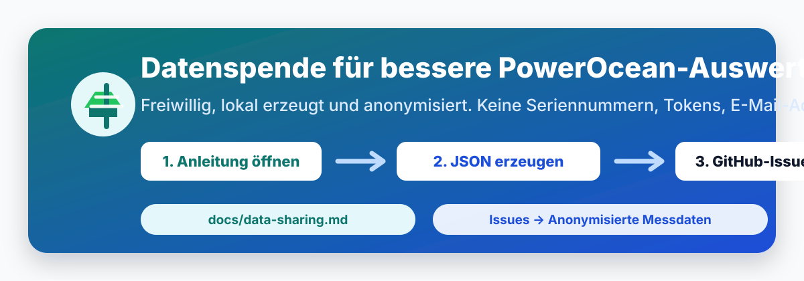
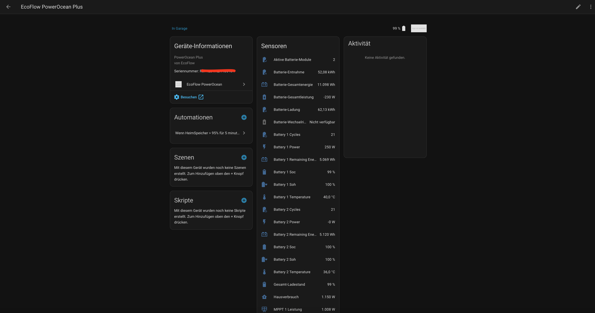
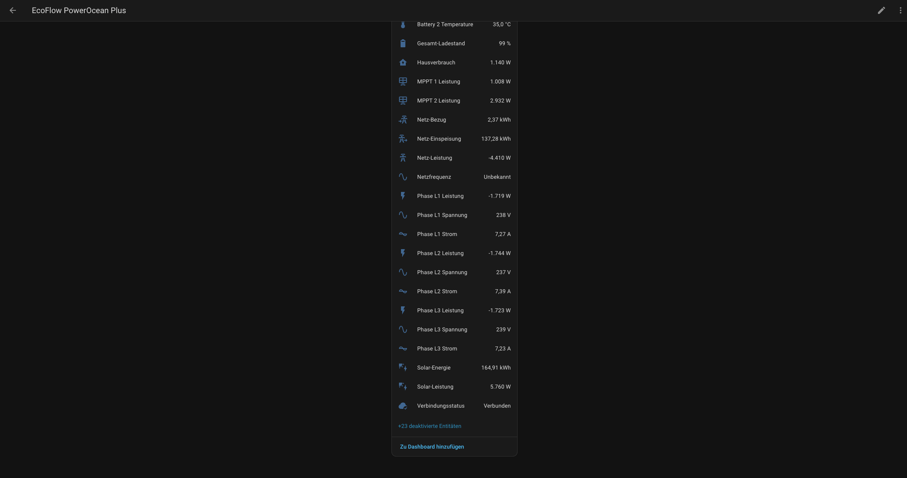
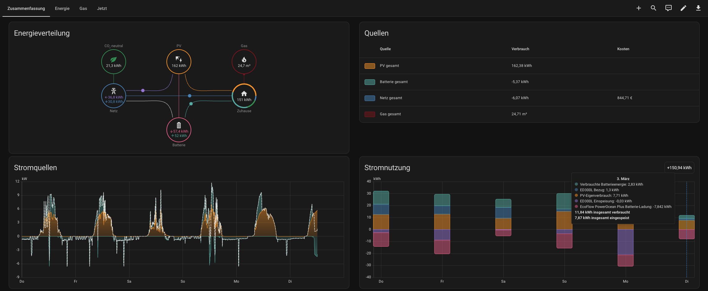
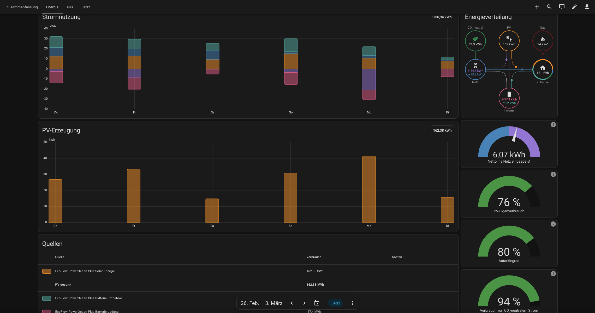
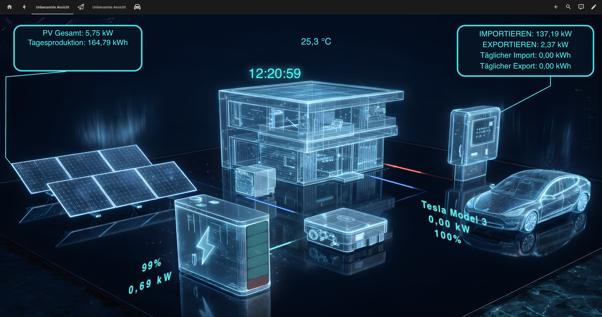

<p align="center">
  <a href="docs/data-sharing.md">
    
  </a>
</p>

> **Datenspende willkommen:** Wer diese Integration verbessern möchte, kann freiwillig anonymisierte EcoFlow-/PowerOcean-Daten teilen.
> Anleitung: [docs/data-sharing.md](docs/data-sharing.md) · Direktes GitHub-Issue: [Anonymisierte Messdaten teilen](https://github.com/Feberdin/ecoflow-powerocean-ha/issues/new?template=data_sample.yml&title=%5BDATA%5D%20)

# EcoFlow PowerOcean Plus — Home Assistant Integration

[](https://github.com/Feberdin/ecoflow-powerocean-ha/releases/latest)
[](https://hacs.xyz)
[](https://www.home-assistant.io)
[](LICENSE)

Inoffizielle Home Assistant Integration für die **EcoFlow PowerOcean Plus** Photovoltaik-Heimspeicheranlage. Echtzeit-Monitoring via MQTT — Batterie, Solar, Netz, 3-Phasen und Energie-Dashboard direkt out of the box.

---

## Highlights

- **Batterie-Monitoring** — SOC, SOH, Temperatur, Zyklen, Leistung für bis zu 9 Packs
- **Energiefluss** — Solar, Netz, Hausverbrauch, Batterie-Gesamtleistung
- **3-Phasen Wechselrichter** — Spannung, Strom, Wirk-/Blind-/Scheinleistung je Phase
- **MPPT-Strings** — Leistung, Spannung, Strom für bis zu 4 Strings
- **Energie-Dashboard** — kWh-Zähler direkt integriert, kein YAML nötig
- **Verbindungsstatus** — MQTT-Verbindung als Sensor für Automationen
- **Options Flow** — Anzahl Batterie-Packs jederzeit änderbar ohne Neueinrichtung
- **Gap-Reconciliation** — bei kurzer Internet-Unterbrechung wird die Energielücke beim Reconnect transparent geschätzt
- **Backup Helpers (optional)** — Laufzeitabschätzung, Stromausfall-Erkennung und Hilfszustände für eigene Automationen
- **Täglicher Sonnenuntergangsbericht (optional)** — Einspeise-kWh, geschätzte Vergütung und Akku-100%-Dauer per Home-Assistant-Nachricht
- **System-Power-Schalter (optional)** — PowerOcean wie in der EcoFlow App ein- oder ausschalten, standardmäßig deaktiviert
- **Praxisbeispiele** — YAML-Vorlagen für eigene Automationen wie PV-Überschussladen

---

## Feature-Wünsche & Feedback

Wenn du neue Funktionen vorschlagen möchtest, nutze bitte das Feature-Template:

- [Feature-Wunsch erstellen](https://github.com/Feberdin/ecoflow-powerocean-ha/issues/new?template=feature_request.md&title=%5BFEATURE%5D%20)

Für Fehler bitte das Bug-Template verwenden:

- [Bug melden](https://github.com/Feberdin/ecoflow-powerocean-ha/issues/new?template=bug_report.md&title=%5BBUG%5D%20)

So bleiben Anforderungen und Prioritäten transparent, und wir können Änderungen besser planen.

---

## Screenshots

### Geräte- und Sensorübersicht in Home Assistant





### Energie-Dashboard (Werte aus dieser Integration)





### Beispielvisualisierung mit Lumina Energy Card



> Hinweis: Die **Lumina Energy Card** ist eine separate Dashboard-Karte.  
> Diese Integration liefert die Sensorwerte, die Visualisierung selbst stammt von Lumina.

---

## Unterstützte Geräte

| Gerät | Seriennummer | Status |
|-------|-------------|--------|
| EcoFlow PowerOcean Plus 15 kW | beginnt mit `R37` | ✅ Getestet |
| EcoFlow PowerOcean Plus (andere Varianten) | — | 🔄 Ungetestet, Feedback willkommen |

---

## Installation

### Methode 1: HACS (empfohlen)

1. HACS öffnen → *Integrationen* → ⋮ → *Benutzerdefinierte Repositories*
2. URL eintragen: `https://github.com/Feberdin/ecoflow-powerocean-ha`, Kategorie: *Integration*
3. *EcoFlow PowerOcean* installieren → Home Assistant neu starten

### Methode 2: Manuell

1. [`custom_components/ecoflow_powerocean/`](custom_components/ecoflow_powerocean/) herunterladen
2. In `<config>/custom_components/ecoflow_powerocean/` kopieren
3. Home Assistant neu starten

### Integration einrichten

*Einstellungen → Geräte & Dienste → + Integration hinzufügen → „EcoFlow PowerOcean"*

| Feld | Beschreibung |
|------|-------------|
| **E-Mail** | EcoFlow App-Konto (nicht Developer API Keys) |
| **Passwort** | EcoFlow App-Passwort (Sonderzeichen werden korrekt verarbeitet) |
| **Seriennummer** | z. B. `R37EXAMPLE000001` — auf dem Typenschild oder in der App |
| **Batterie-Packs** | Anzahl installierter Packs (Standard: 2) |

> **Hinweis:** Zwei-Faktor-Authentifizierung muss in der EcoFlow App deaktiviert sein.

### Anzahl Batterie-Packs nachträglich ändern

*Einstellungen → Geräte & Dienste → EcoFlow PowerOcean → Konfigurieren*

Die Integration lädt sich danach automatisch neu.

### Backup Helpers aktivieren

Die Backup Helpers sind **optional** und standardmäßig **deaktiviert**.
Du findest sie ebenfalls unter:

*Einstellungen → Geräte & Dienste → EcoFlow PowerOcean → Konfigurieren*

Damit bleibt die Kernintegration für alle bestehenden Nutzer unverändert. Erst wenn du das Feature aktivierst, werden zusätzliche Helper-Entitäten angelegt.

---

## Optionaler System-Power-Schalter

Der System-Power-Schalter ist **optional** und standardmäßig **deaktiviert**.
Du aktivierst ihn unter:

*Einstellungen → Geräte & Dienste → EcoFlow PowerOcean → Konfigurieren → System-Power-Schalter aktivieren*

Danach legt die Integration eine `switch`-Entität an, die denselben
System-Power-Befehl verwendet wie die EcoFlow App. Damit kann der PowerOcean
per Home Assistant ein- oder ausgeschaltet werden.

Wichtig:
- Beim Ausschalten stoppt die Anlage die Produktion.
- Beim Einschalten kann es 1–2 Minuten dauern, bis der echte Gerätestatus wieder zurückgemeldet wird.
- Der Schalter zeigt bis zur ersten echten Rückmeldung einen angenommenen Zustand an.
- Bestehende Sensoren, Energy-Dashboard-Zähler und Backup Helpers bleiben unverändert.

### Einordnung der möglichen Nacht-Ersparnis

Der belegte Herstellerwert für den PowerOcean Plus liegt bei
**unter 20,5 W Eigenverbrauch nachts**. Bei 10 Stunden Nacht entspricht das
rund **0,205 kWh pro Nacht**, also etwa **6,15 kWh pro Monat** oder
**74,8 kWh pro Jahr**.

Bei einem angenommenen Netzstrompreis von `0,35 €/kWh` entspricht das:

| Zeitraum | Energie | Brutto-Effekt bei 0,35 €/kWh | Gegenüber Einspeisevergütung 0,077 €/kWh |
|----------|---------|------------------------------|------------------------------------------|
| Tag/Nacht | 0,205 kWh | 0,07 € | 0,06 € |
| Monat (30 Tage) | 6,15 kWh | 2,15 € | 1,68 € |
| Jahr | 74,8 kWh | 26,18 € | 20,43 € |

Wenn eine konkrete Anlage im Standby tatsächlich höher liegt, z. B. bei
`100 W`, steigt der Effekt entsprechend auf ca. **1,0 kWh pro Nacht**,
**30 kWh pro Monat** und **365 kWh pro Jahr**. Das wären bei `0,35 €/kWh`
etwa **0,35 € pro Tag**, **10,50 € pro Monat** und **127,75 € pro Jahr**.

Die Werte sind eine technische Orientierung. Ob sich das automatische
Abschalten lohnt, hängt von realem Eigenverbrauch, Nachtlänge,
Strompreis, Einspeisevergütung und gewünschter Anlagenverfügbarkeit ab.

### Reserve-Automatik für den System-Power-Schalter

Die Reserve-Automatik ist **optional** und standardmäßig **deaktiviert**.
Sie nutzt den vorhandenen Wert `Reservierter Backup-SOC (%)`. Wenn dieser
z. B. auf `10` steht, kann die Integration den PowerOcean nachts automatisch
ausschalten, sobald der Gesamt-Ladestand 10 % erreicht.

Wichtig ist die Wiedereinschaltlogik: Die Anlage wird nach einer automatischen
Abschaltung spätestens bei Sonnenaufgang wieder eingeschaltet, damit PV-Erzeugung
und Batterieladung wieder anlaufen können. Zusätzlich gibt es eine
Einschalt-Hysterese über der Reserve. Bei Reserve `10 %` und Hysterese `2 %`
darf die Integration auch nachts wieder einschalten, wenn der SOC auf mindestens
`12 %` steigt.

Die Automatik schaltet nur wieder ein, wenn sie vorher selbst ausgeschaltet hat.
Ein manuell ausgeschalteter Wechselrichter bleibt deshalb aus. Wenn die Backup
Helpers einen Stromausfall oder aktiven Backupbetrieb erkennen, wird nicht
automatisch geschaltet.

Warum die Einschränkung wichtig ist: Wenn der Wechselrichter ausgeschaltet ist,
wird der Akku normalerweise nicht mehr als AC-Quelle für das Haus genutzt. Das
Haus bezieht dann Netzstrom, während der Akku im Wesentlichen stehen bleibt. Das
ist sinnvoll, wenn man nachts nur Leerlaufverluste vermeiden und eine Reserve
halten möchte. Es ist nicht sinnvoll, wenn das Haus nachts bewusst aus dem Akku
versorgt werden soll oder wenn maximale Notstrombereitschaft wichtiger ist als
die mögliche Standby-Ersparnis.

---

## Täglicher Sonnenuntergangsbericht

Der tägliche Sonnenuntergangsbericht ist **optional** und standardmäßig **deaktiviert**.
Du aktivierst ihn unter:

*Einstellungen → Geräte & Dienste → EcoFlow PowerOcean → Konfigurieren*

Der Bericht sendet bei Sonnenuntergang eine Home-Assistant-Nachricht an das gewählte Ziel.
Er enthält:

- die an diesem lokalen Kalendertag bis Sonnenuntergang eingespeiste Energie in kWh
- die daraus berechnete Vergütung in Euro
- die Dauer, in der der Akku an diesem Tag bei 100 % SOC stand

Der Sonnenuntergangsbericht nutzt den Home-Assistant-Sunset-Trigger und
zusätzlich einen defensiven Catch-up alle paar Minuten. Falls Home Assistant
genau zum Sonnenuntergang neu startet oder der einmalige Trigger verpasst
wird, sendet die Integration den Bericht nachträglich, sobald `sun.sun` zeigt,
dass der heutige Sonnenuntergang bereits vorbei ist.

### Optionen

| Option | Standard | Bedeutung |
|--------|----------|-----------|
| `Täglichen Sonnenuntergangsbericht aktivieren` | `false` | Schaltet die tägliche Nachricht frei |
| `Benachrichtigungsziel` | leer | Notify-Entität für `notify.send_message`; wird als Auswahlliste angezeigt |
| `Einspeisevergütung (€/kWh)` | `0,077` | Tarif für `Einspeisung kWh × Tarif` |

Wenn der Bericht aktiviert ist, legt die Integration zusätzlich den Button
**„Tagesbericht von gestern senden“** an. Der Button sendet den zuletzt
gespeicherten Bericht des vorherigen lokalen Kalendertags erneut und markiert
den echten Sonnenuntergangsbericht nicht als gesendet.
Direkt nach dem Update kann es noch keinen gespeicherten Vortag geben; dann
sendet der Button einen kurzen Hinweis statt mit einem Fehler abzubrechen.

Wenn der Bericht aktiviert ist, legt die Integration zusätzlich drei
Long-Term-Statistic-Sensoren an:

- `Tagesbericht Gesamt-Einspeisung` in kWh
- `Tagesbericht Gesamt-Vergütung` in EUR
- `Tagesbericht Akku 100 % Gesamtzeit` in Stunden

Diese Statistik startet mit dem Tagesbericht-Speicher. Aus alten Versionen
können nur der aktuell gespeicherte Tag und der zuletzt gespeicherte Vortag
konservativ übernommen werden. Die bestehende Entität `Netz-Einspeisung`
bleibt unverändert und ist weiterhin die Quelle für das Home-Assistant
Energie-Dashboard.

Der Default-Tarif `0,077 €/kWh` stammt aus einer Westnetz-Abrechnung:
17 kWh zu `0,0786 €/kWh` und 3 kWh zu `0,068 €/kWh` ergeben zusammen 20 kWh und 1,54 Euro.

Die Werte sind Monitoring- und Komfortwerte der Integration. Sie sind nicht als rechtsverbindliche Abrechnung gedacht, weil MQTT-/HA-Ausfälle defensiv begrenzt und nicht abrechnungsgenau rekonstruiert werden.

---

## Backup Helpers

Der Backup-Helper-Layer bewertet den aktuellen Backup-Zustand deiner Anlage, ohne direkte Fremdsteuerung in den Core einzubauen.

Wichtig:
- Die Integration **erkennt und bewertet** Backup-/Outage-Zustände.
- Die eigentliche Aktion baust du selbst als Home-Assistant-Automation.
- Es gibt **keine feste Unraid-, Tuya- oder Steckdosen-Logik** im Python-Code.

### Optionen

| Option | Standard | Bedeutung |
|--------|----------|-----------|
| `Backup Helpers aktivieren` | `false` | Schaltet die zusätzlichen Helper-Entitäten frei |
| `Bei Stromausfall benachrichtigen` | `false` | Sendet eine Nachricht, wenn Stromausfall und aktive Batterieversorgung erkannt werden |
| `Stromausfall-Benachrichtigungsziel` | leer | Notify-Entität für die Stromausfall-Nachricht |
| `Reservierter Backup-SOC (%)` | `10` | Prozentuale Batterie-Reserve, die für Laufzeit-Schätzungen nicht verplant wird |
| `Grenzwert Netzleistung für Ausfallerkennung (W)` | `50` | Netzleistung innerhalb dieses Bereichs zählt als „nahe null“ |
| `Mindest-Netzfrequenz für gültiges Netzsignal (Hz)` | `1.0` | Frequenzen darunter oder fehlende Frequenz nach zuvor gültigem Signal gelten als Hinweis auf Netzausfall |
| `Glättungsfenster für Laufzeit (Minuten)` | `10` | Mittelt den Hausverbrauch, damit Peaks die Laufzeit nicht zu stark verzerren |
| `Kritische Restlaufzeit (Minuten)` | `120` | Unterhalb dieses Werts wird die Backup-Reserve als kritisch markiert |

### Neue Sensoren

| Sensor | Einheit | Bedeutung |
|--------|---------|-----------|
| `Geschätzte Backup-Laufzeit (Minuten)` | min | Restlaufzeit auf Basis geglätteter Last und nutzbarer Energie |
| `Geschätzte Backup-Laufzeit (Stunden)` | h | Dieselbe Information in Stunden |
| `Nutzbare Backup-Energie` | Wh | Energie oberhalb der konfigurierten SOC-Reserve |
| `Empfohlene Backup-Aktion` | Enum | `normal` / `shed_load` / `shutdown_recommended` / `unknown` |

### Neue Binary-Sensoren

| Binary Sensor | Bedeutung |
|---------------|-----------|
| `Stromausfall erkannt` | Netzverlust ist nach kombinierter Heuristik wahrscheinlich |
| `Backup-Reserve kritisch` | Geschätzte Restlaufzeit liegt unter deiner kritischen Schwelle |
| `Backup aktiv` | Das Haus wird im erkannten Backup-/Inselzustand plausibel lokal versorgt |

### Stromausfall-Benachrichtigung

Wenn `Bei Stromausfall benachrichtigen` aktiviert ist, sendet die Integration
eine Home-Assistant-Notify-Nachricht, sobald gleichzeitig gilt:

- `Stromausfall erkannt` ist aktiv
- `Backup aktiv` ist aktiv
- ein `Stromausfall-Benachrichtigungsziel` ist gesetzt

Die Nachricht wird nur einmal pro zusammenhängender Ausfallphase gesendet.
Sobald die Backup Helpers wieder Normalzustand erkennen, wird die
Benachrichtigung für den nächsten Ausfall erneut scharf geschaltet.

Zusätzlich wird der Button **„Stromausfall-Benachrichtigung testen“** angelegt.
Er sendet eine Testnachricht an dasselbe Ziel und verändert den Ausfall-Merker
nicht.

### Wie die Stromausfall-Erkennung arbeitet

Die Erkennung ist bewusst **konservativ** und vermeidet Fehlalarme im normalen Nullpunktbetrieb.

Ein Stromausfall wird nur dann als wahrscheinlich gewertet, wenn über einen kurzen stabilen Zeitraum gleichzeitig gilt:
- Es gab zuvor gültige Netzfrequenz-Samples, und die Frequenz fehlt jetzt oder liegt unter dem konfigurierten Mindestwert
- Die Netzleistung bleibt nahe `0 W`
- Es liegt echte Hauslast an
- PV und/oder Batterie versorgen das Haus plausibel weiter

Wenn die Anlage **nie ein brauchbares Frequenzsignal liefert**, bleibt `Stromausfall erkannt` absichtlich aus. In diesem Fall sind die Laufzeit- und Reserve-Sensoren trotzdem nutzbar, aber die Outage-Erkennung ist bewusst zurückhaltend.

### Automationsbeispiele

Die folgenden Beispiele sind **nur Dokumentation**. Du passt die Ziel-Entitäten an deine eigene Home-Assistant-Umgebung an.

#### 1. Bei Stromausfall Unraid sauber herunterfahren

```yaml
alias: PowerOcean Backup - Unraid sauber herunterfahren
mode: single
trigger:
  - platform: state
    entity_id: binary_sensor.mein_powerocean_stromausfall
    to: "on"
    for: "00:01:00"
condition:
  - condition: state
    entity_id: binary_sensor.unraid_server_online
    state: "on"
action:
  - service: button.press
    target:
      entity_id: button.unraid_graceful_shutdown
```

#### 2. Bei kritischer Restlaufzeit bestimmte Steckdosen ausschalten

```yaml
alias: PowerOcean Backup - Nicht kritische Lasten abschalten
mode: single
trigger:
  - platform: state
    entity_id: binary_sensor.mein_powerocean_backup_reserve_kritisch
    to: "on"
    for: "00:02:00"
condition:
  - condition: state
    entity_id: binary_sensor.mein_powerocean_backup_aktiv
    state: "on"
action:
  - service: switch.turn_off
    target:
      entity_id:
        - switch.waschmaschine
        - switch.trockner
        - switch.garagensteckdose
```

Diese Beispiele zeigen den gewünschten Architekturpunkt:
- **Die Integration liefert Hilfs-Entitäten**
- **Home Assistant entscheidet per Automation, was konkret passieren soll**

### PV-Überschussladen mit Wallbox

Ein ausführliches Beispiel für PV-Überschussladen mit EcoFlow-Sensoren und
einer steuerbaren Wallbox liegt hier:

- [Anleitung: PV-Überschussladen übertragen](docs/pv-ueberschussladen.md)
- [YAML-Vorlage für go-eCharger/Wallbox](examples/pv-ueberschussladen-goecharger.yaml)

Die Vorlage nutzt EcoFlow-Werte für Solarleistung, Hausverbrauch, Netzleistung
und Speicher-SOC. Die konkrete Wallbox- oder Verbrauchersteuerung bleibt in
Home Assistant und muss auf die eigenen Entity-IDs angepasst werden.

---

## Sensoren

### Pro Batterie-Pack

| Sensor | Einheit | Aktiv |
|--------|---------|:-----:|
| Ladestand (SOC) | % | ✅ |
| Gesundheitszustand (SOH) | % | ✅ |
| Leistung | W | ✅ |
| Verbleibende Energie | Wh | ✅ |
| Temperatur (Umgebung) | °C | ✅ |
| Ladezyklen | — | ✅ |
| MOSFET-Temperatur | °C | ❌ |
| Spannung | V | ❌ |
| Strom | A | ❌ |

### System — Energiefluss

| Sensor | Einheit | Beschreibung | Aktiv |
|--------|---------|-------------|:-----:|
| Solar-Leistung | W | PV-Gesamtertrag aller MPPT-Strings | ✅ |
| Netz-Leistung | W | Positiv = Bezug, Negativ = Einspeisung | ✅ |
| Hausverbrauch | W | Aktuelle Lastleistung | ✅ |
| Batterie-Gesamtleistung | W | Positiv = Entladen, Negativ = Laden | ✅ |
| Gesamt-Ladestand | % | Kombinierter SOC aller Packs | ✅ |
| Batterie-Gesamtenergie | Wh | Verbleibende Energie systemweit | ✅ |
| Aktive Batterie-Module | — | Anzahl kommunizierender Packs | ✅ |
| DC-Bus-Spannung | V | Interne DC-Bus-Spannung | ❌ |

### System — Wechselrichter / 3-Phasen

| Sensor | Einheit | Aktiv |
|--------|---------|:-----:|
| Phase L1/L2/L3 Spannung | V | ✅ |
| Phase L1/L2/L3 Strom | A | ✅ |
| Phase L1/L2/L3 Wirkleistung | W | ✅ |
| Phase L1/L2/L3 Blindleistung | var | ❌ |
| Phase L1/L2/L3 Scheinleistung | VA | ❌ |
| Netzfrequenz | Hz | ✅ |
| MPPT 1/2 Leistung | W | ✅ |
| MPPT 3/4 Leistung | W | ❌ |
| MPPT 1–4 Spannung | V | ❌ |
| MPPT 1–4 Strom | A | ❌ |

### Energie-Akkumulatoren (für Energie-Dashboard)

| Sensor | Einheit | Beschreibung |
|--------|---------|-------------|
| Solar-Energie | kWh | Kumulierter PV-Ertrag |
| Netz-Bezug | kWh | Kumulierter Strombezug |
| Netz-Einspeisung | kWh | Kumulierte Einspeisung |
| Batterie-Entnahme | kWh | Kumulierte Energie aus der Batterie |
| Batterie-Ladung | kWh | Kumulierte Energie in die Batterie |

### Status

| Sensor | Beschreibung |
|--------|-------------|
| Verbindungsstatus | MQTT-Verbindung: `connected` / `disconnected` |
| System-Power-Status | Aus EcoFlow-Rückmeldung gelesener Zustand: `on` / `off` / `unknown` |
| System-Arbeitsmodus | Ausgelesener EMS-Arbeitsmodus, z. B. Eigenverbrauch oder Standby |
| System-Arbeitszustand | Ausgelesener EMS-Arbeitszustand, z. B. `running` oder `stop` |
| System-Netzstatus | Rohwert des gemeldeten Netzstatus |
| Batterie-Ladegrenze | Ausgelesene obere Batterie-Ladegrenze in % |
| Batterie-Entladegrenze | Ausgelesene untere Batterie-Entladegrenze in % |
| Backup-Reserve | Ausgelesener Backup-Anteil in % |
| Einspeise-Modus / Ratio / Leistung | Ausgelesene Einspeise-Konfiguration und Leistung, sofern vom Gerät geliefert |
| Batterie gesamt geladen / entladen | Vom Gerät gemeldete kumulierte Batterie-Energie in kWh |

> Deaktivierte Sensoren lassen sich unter *Einstellungen → Geräte & Dienste → EcoFlow PowerOcean → Entitäten* aktivieren.

Der Sensor **Gesamt-Ladestand** plausibilisiert den Energy-Stream-SOC gegen
frische Batteriepack-SOCs. Kurze falsche Sprünge auf 100 % werden verworfen,
wenn die Pack-Werte deutlich dagegen sprechen. Zur Diagnose enthält der Sensor
Attribute wie `soc_source`, `stream_soc`, `pack_average_soc` und
`soc_discrepancy_percent`.

---

## Energie-Dashboard einrichten

Die kWh-Sensoren sind direkt einsatzbereit. Navigiere zu *Einstellungen → Dashboards → Energie*:

| Dashboard-Bereich | Sensor |
|-------------------|--------|
| **Netz** → Strom aus dem Netz | `Netz-Bezug` |
| **Netz** → Strom zurück ins Netz | `Netz-Einspeisung` |
| **Solar** → Solaranlage | `Solar-Energie` |
| **Heimspeicher** → Energie ins System | `Batterie-Entnahme` |
| **Heimspeicher** → Energie aus dem System | `Batterie-Ladung` |
| **Heimspeicher** → Aktueller Ladestand | `Gesamt-Ladestand` |

**Hinweise:**
- Zähler starten mit der ersten MQTT-Nachricht — historische Werte werden nicht rückwirkend berechnet
- Werte bleiben über HA-Neustarts erhalten
- Seit 0.4.25 werden Verbindungs- und Messlücken nicht mit Energie aufgefüllt.
  Nur Intervalle bis 120 Sekunden mit gültigen Randmessungen werden integriert.
  `skipped_seconds_since_start` zeigt ausgelassene Zeit seit dem HA-Start.
- Frische Detailtelegramme (96/34) werden anhand ihres Gerätezeitstempels
  ausgewertet. Historische Pakete sind keine Live-Werte.
- EMS-Phasenleistung gehört zum Wechselrichter, nicht zum Netzanschlusspunkt.
  Ohne frischen Energiefluss bleiben Netzleistung und Hausverbrauch unbekannt.
  `power_source` und `power_observed_at` zeigen Quelle und Messzeitpunkt.
- Bestehende Zählerstände und historische Statistikfehler werden nicht rückwirkend
  verändert. Ein Update allein macht ältere Amortisationswerte nicht zuverlässig.
- Kleine Messschwankungen (±5 W) können gleichzeitig minimale Bezugs- und Einspeisungswerte erzeugen — physikalisch normal, Einfluss auf Monatssummen vernachlässigbar

---

## Fehlerbehebung

### Sensor zeigt „Nicht verfügbar"

1. EcoFlow App öffnen — ist das Gerät dort online?
2. HA-Netzwerkverbindung prüfen
3. Logs prüfen: *Einstellungen → System → Logs → „ecoflow"*
4. Verbindungsstatus-Sensor prüfen: zeigt er `disconnected`?
5. Im Verbindungsstatus-Sensor die Attribute `last_gap_*` prüfen (Start/Ende/Dauer der letzten Lücke)

### Login schlägt fehl

- **App-Zugangsdaten** verwenden (E-Mail + Passwort der EcoFlow App, keine Developer API Keys)
- Bei 2FA: muss in der EcoFlow App deaktiviert sein
- Sonderzeichen im Passwort werden korrekt behandelt

### HACS zeigt kein Update an oder „Konfigurieren“ lädt nicht

1. In Home Assistant prüfen, welche Version wirklich installiert ist:

   ```bash
   grep '"version"' /config/custom_components/ecoflow_powerocean/manifest.json
   ```

2. Wenn dort nicht die aktuelle GitHub-Release-Version steht: HACS öffnen,
   *EcoFlow PowerOcean* auswählen und über das Menü die Informationen neu laden
   oder die Integration erneut herunterladen.
3. Danach Home Assistant vollständig neu starten, nicht nur die Integration neu laden.
4. Wenn der Konfigurieren-Dialog weiter mit `400: Bad Request` abbricht, diese
   Logger kurzzeitig aktivieren und den neuen Log-Ausschnitt anhängen:

   ```yaml
   logger:
     default: warning
     logs:
       homeassistant.config_entries: debug
       homeassistant.helpers.data_entry_flow: debug
       custom_components.ecoflow_powerocean: debug
       custom_components.ecoflow_powerocean.config_flow: debug
   ```

### Debug-Logging aktivieren

**Einfach über die UI (empfohlen):**

1. *Einstellungen → Geräte & Dienste → EcoFlow PowerOcean → Konfigurieren*
2. Option **„Debug-Modus aktivieren“** einschalten
3. Speichern (Integration wird neu geladen)

**Diagnose-Datei für Support/Issues exportieren:**

1. *Einstellungen → Geräte & Dienste → EcoFlow PowerOcean*
2. Menü (⋮) → **„Diagnose herunterladen“**
3. Die heruntergeladene Datei im GitHub-Issue anhängen

Die Diagnose redigiert sensible Daten (z. B. Passwort/Token/Seriennummer) automatisch.

**Alternativ per YAML:**

```yaml
# configuration.yaml
logger:
  default: warning
  logs:
    custom_components.ecoflow_powerocean: debug
```

---

## Technischer Hintergrund

### Kommunikation

Die PowerOcean Plus kommuniziert ausschließlich über die EcoFlow Cloud — eine lokale API ist nicht öffentlich dokumentiert. Diese Integration nutzt denselben Weg wie die offizielle EcoFlow App:

```
Home Assistant
    ├─ HTTPS ──► api.ecoflow.com          (Login + MQTT-Credentials)
    └─ MQTTS ──► mqtt-e.ecoflow.com:8883  (Echtzeit-Gerätedaten)
```

### Protokoll

Alle MQTT-Nachrichten sind als [Protocol Buffers](https://protobuf.dev/) kodiert und XOR-verschlüsselt. Der Decoder ist in reinem Python implementiert — keine nativen Abhängigkeiten außer `paho-mqtt`.

| cmdFunc | cmdId | Nachrichtentyp | Inhalt |
|---------|-------|---------------|--------|
| 96 | 1 | `JTS1_EMS_HEARTBEAT` | Wechselrichter, 3-Phasen, MPPT |
| 96 | 7 | `JTS1_BP_STA_REPORT` | Batterie-Pack-Status |
| 96 | 17 | `JTS1_EMS_CHANGE_REPORT` | System-Power-Status, Arbeitsmodus, Grenzwerte, Feed-in-Werte |
| 96 | 105 | `set`-Befehl | Optionaler System-Power-Befehl AN/AUS, nur wenn der Schalter aktiviert ist |

### Warum nicht die offizielle Developer API?

Die EcoFlow Developer API gibt für den PowerOcean Plus den Fehler **1006 „not allowed"** zurück. Das MQTT-Topic der Open API liefert ebenfalls keine Daten. Diese Integration verwendet daher die Private API (App-Login) — identisch mit der offiziellen EcoFlow App.

---

## Mitwirken

Beiträge, Bugreports und Feedback sind herzlich willkommen!

### Messdaten sicher teilen

Wenn du Messdaten aus dieser Integration oder aus einem anderen Repo beisteuern
möchtest, nutze bitte das dokumentierte Format in
[`docs/data-sharing.md`](docs/data-sharing.md). Das Format enthält Live-Leistung,
Energiezähler, Batteriepackdaten, Backup-Schätzung, Tagesberichtswerte,
Systemstatus, anonymisierte EcoFlow-/PowerOcean-Rohzustände und optional
monatliche Home-Assistant-Langzeitstatistiken.

Das Teilen ist freiwillig. Die Daten werden nicht automatisch hochgeladen und
sollen ausschließlich zur Verbesserung dieser Integration, der Auswertelogik und
der Dokumentation verwendet werden.

Bitte niemals Seriennummern, E-Mail-Adressen, Tokens, Cookies oder Standortdaten
teilen. Für GitHub gibt es zusätzlich die Vorlage „Anonymisierte Messdaten“.
Ein lokaler Snapshot kann ohne Zusatzabhängigkeiten mit
`tools/build_anonymized_observation.py` erzeugt werden.

### Lokale Validierung

```bash
cd /Users/joachim.stiegler/EcoFlow/ha_integration
python3 -m unittest tests.test_backup_helpers
python3 -m py_compile custom_components/ecoflow_powerocean/*.py
```

**Besonders gesucht:**
- Tester mit anderen PowerOcean Plus Varianten (andere Leistungsklassen, andere Seriennummern)
- Entwickler für lokalen Modbus TCP Zugriff (Port 502 ist offen)

Issues und Pull Requests bitte über GitHub einreichen.

---

## Danksagungen

- [foxthefox/ioBroker.ecoflow-mqtt](https://github.com/foxthefox/ioBroker.ecoflow-mqtt) — Protobuf-Schema und Protokolldokumentation
- [tolwi/hassio-ecoflow-cloud](https://github.com/tolwi/hassio-ecoflow-cloud) — API-Struktur und HA-Integrationsmuster
- [mmiller7/ecoflow-withoutflow](https://github.com/mmiller7/ecoflow-withoutflow) — MQTT-Credential-Extraktion

---

## Versionslog

> Die Reihenfolge ist chronologisch nach inhaltlicher Entwicklung.  
> GitHub-Release-Publikationszeiten können davon abweichen.

| Version | Inhalt | Beweggrund |
|---------|--------|------------|
| `v0.1.2` | Basis der Sensor-Entitäten stabilisiert (Battery-Sensoren beim Setup vorbereitet) | Zuverlässigere Entitätserstellung beim ersten Laden |
| `v0.1.3` | MQTT-Auth-Probleme (`Not authorized`) behoben | Verbindungsaufbau zum Broker robuster machen |
| `v0.1.4` | MQTT Client-ID Format korrigiert | Kompatibilität mit EcoFlow Brokeranforderungen |
| `v0.2.0` | Breitere Sensorabdeckung aus API/MQTT-Daten | Mehr Messwerte für reale PV-Setups verfügbar machen |
| `v0.2.1` | Energiefluss-Sensoren korrigiert | Falsche/inkonsistente Livewerte reduzieren |
| `v0.2.2` | Energie-Dashboard ohne zusätzliche YAML-Konfiguration nutzbar | Einstieg für Nutzer ohne manuelle YAML-Arbeit vereinfachen |
| `v0.2.3` | Netzfrequenz-Fix | Stabilere Hz-Anzeige trotz lückenhafter Telegramme |
| `v0.3.0` | Neue Sensoren, Options Flow, Verbindungsstatus | Bedienbarkeit erhöhen und Konfiguration über UI ermöglichen |
| `v0.3.1` | Vorzeichen-/Leistungslogik verbessert | Abweichungen zwischen App und HA bei Grid/Battery reduzieren |
| `v0.3.2` | Weitere Korrekturen im Energiefluss | Konsistentere Bilanz bei wechselnden Lastsituationen |
| `v0.3.3` | Stabilitäts- und Datenqualitätsfixes | Zuverlässigkeit im Dauerbetrieb erhöhen |
| `v0.3.4` | Debug-Modus + Diagnostics-Export | Support und Fehleranalyse für Nutzer/Issues vereinfachen |
| `v0.3.5` | Fix für `TypeError` nach Debug-Umschaltung (`num_battery_packs` float/int) | Absturz beim Reconfigure zuverlässig beheben |
| `v0.3.6` | Gap-Reconciliation bei MQTT/Internet-Lücken (geschätzte Nachführung) + Gap-Metadaten | Energie-Summen nach Verbindungsabbrüchen nachvollziehbar weiterführen |
| `v0.4.0` | Optionaler Backup-Helper-Layer mit Laufzeitabschätzung, Stromausfall-Heuristik und Binary-Sensoren | Backup-/Outage-Zustände bewerten, ohne Fremdsteuerung hart in den Core zu bauen |
| `v0.4.1` | Optionaler täglicher Sonnenuntergangsbericht mit Einspeise-kWh, Vergütung und Akku-100%-Dauer | Komfortauswertung für Tagesertrag und volle Akku-Zeit direkt per HA-Nachricht |
| `v0.4.2` | Options-Flow-Fix für Benachrichtigungsziel-Auswahl | Konfigurieren-Dialog in Home Assistant wieder zuverlässig laden |
| `v0.4.3` | Notify-Ziel im Options Flow auf robustes Textfeld umgestellt | 400-Fehler beim Laden des Konfigurieren-Dialogs vermeiden |
| `v0.4.4` | Kompatibilitätsfix für `ConfigFlowResult` in Home Assistant 2024.1 | Config-Flow-Import auf älteren HA-Versionen wieder ermöglichen |
| `v0.4.5` | Options Flow initialisiert den zugehörigen Config Entry explizit | Konfigurieren-Dialog auf HA 2024.1 kompatibel starten |
| `v0.4.6` | HACS-/HA-Troubleshooting für installierte Manifest-Version ergänzt | Sichtbar machen, ob Home Assistant wirklich den aktuellen Code geladen hat |
| `v0.4.7` | Options Flow nutzt eigenen Config-Entry-Verweis statt HA-Property zu überschreiben | 500-Fehler beim Konfigurieren auf neueren HA-Versionen vermeiden |
| `v0.4.8` | Manifest-Reihenfolge fuer Hassfest korrigiert und Brand-Icon ergaenzt | HACS-/Hassfest-Validierung stabil gruen halten |
| `v0.4.9` | Notify-Ziel als Entitätsauswahl und Button „Tagesbericht testen“ ergänzt | Tagesbericht sofort prüfbar machen und falsche Notify-Zielwerte vermeiden |
| `v0.4.10` | Testbutton sendet den gespeicherten Bericht von gestern | Verpasste Sonnenuntergangsberichte am Folgetag manuell erneut senden |
| `v0.4.11` | Testbutton sendet bei fehlendem Vortag einen Hinweis statt HA-Fehler | Erste Nutzung nach Update verständlich machen |
| `v0.4.12` | Sunset-Callback fuer Home-Assistant-Signatur korrigiert, Catch-up und Statistik-Sensoren ergänzt | Täglichen Bericht zuverlässig auslösen und Langzeitwerte sichtbar machen |
| `v0.4.13` | Optionale Stromausfall-Benachrichtigung inklusive Testbutton ergänzt | Handy-Nachricht senden, wenn Backup Helpers Stromausfall und Batterieversorgung erkennen |
| `v0.4.14` | Veraltete Energy-Stream-Daten werden gegenüber frischeren Batterie-/EMS-Daten erkannt | SOC-Sprünge und Fortschreiben alter Leistungswerte nach App-/Cloud-Lücken vermeiden |
| `v0.4.15` | Hintergrundaufgaben aus synchronen HA-Callbacks thread-sicher geplant | Home-Assistant-Warnungen und potenzielle Thread-Safety-Probleme vermeiden |
| `v0.4.16` | EMS-Batterievorzeichen normalisiert, wenn Energy-Stream-Daten veraltet sind | Hausverbrauch und Batterie-Lade-/Entladezähler bei frischen EMS-Fallbackwerten korrekt halten |
| `v0.4.17` | Optionaler System-Power-Schalter und zusätzliche EMS-Statussensoren ergänzt | PowerOcean wie in der EcoFlow App ein-/ausschalten und weitere ausgelesene Endpunkte für Automationen sichtbar machen |
| `v0.4.18` | Mindestversion von `paho-mqtt` auf `2.1.0` angehoben und GitHub Actions aktualisiert | Security-/Wartungs-PRs auflösen und Node-20-Deprecation-Warnungen in CI vermeiden |
| `v0.4.19` | Partielle EMS-Statusmeldungen erhalten den zuletzt bekannten System-Power-Status | Verhindert, dass `System-Power-Status` nach einem unvollständigen Status-Telegramm auf `unknown` zurückfällt |
| `v0.4.20` | Optionale System-Power-Reserve-Automatik und anonymisiertes Messdatenformat ergänzt | Akku-Reserve nachts schützen und externe Beobachtungsdaten strukturiert für Analysen einsammeln |
| `v0.4.21` | Anonymisiertes Messdatenformat auf reichere v2-Snapshots erweitert | Mehr Analyseinformationen teilen, ohne Seriennummern, Tokens, Standort oder vollständige Entity-IDs offenzulegen |
| `v0.4.22` | Anonymisierten Datenspende-Export auf v3 erweitert | Freiwillig geteilte EcoFlow-Daten breiter erfassen, Monatsstatistiken aufnehmen und die Zweckbindung klar dokumentieren |
| `v0.4.23` | Datenspende-Hinweis mit Grafik prominent ergänzt | Nutzer direkt oben im Repo zeigen, wo und wie sie anonymisierte Daten teilen können |
| `v0.4.24` | Kurzzeitige Energy-Stream-SOC-Ausreißer gegen frische Batteriepack-SOCs plausibilisiert | Falsche 100-%-Meldungen und dadurch ausgelöste Automationen vermeiden |
| `v0.4.25` | Keine Energieerfindung in Verbindungslücken; zeitgestempelte Detailtelegramme; kein PCS-Netzzählerersatz | Nacht-PV durch Lückenschätzung vermeiden und fehlende Messwerte ausdrücklich kennzeichnen |

---

## Lizenz

MIT — siehe [LICENSE](LICENSE)

**Haftungsausschluss:** Diese Integration ist nicht offiziell von EcoFlow unterstützt oder autorisiert. EcoFlow kann die API jederzeit ändern. Nutzung auf eigene Gefahr.
